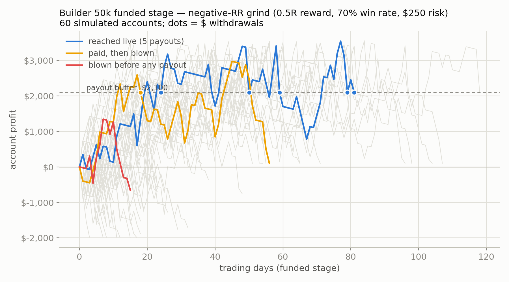
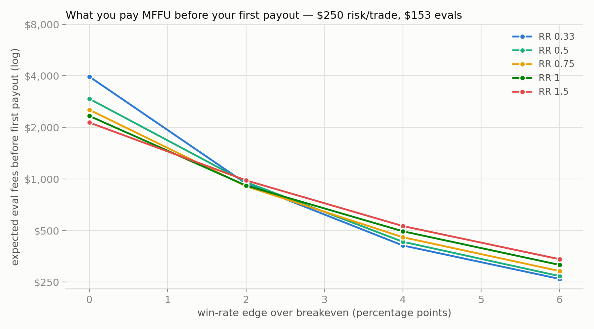
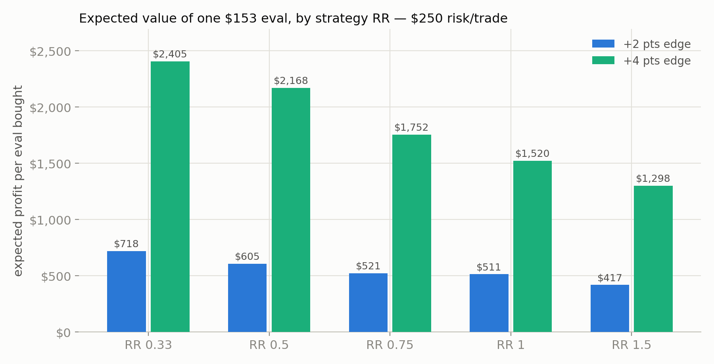

# Negative-RR strategies on the MFFU Builder 50k: eval cost vs. payout math

**Question:** we're not building alpha for a hedge fund — we're farming prop-firm
payouts. Given a negative risk:reward strategy (small winners, high win rate) with
some statistical edge, how much do you have to invest in evals before you get a
payout, how many accounts pass, and how many blow up?

**Method:** Monte Carlo simulation (`simulate.py`) of the full Builder 50k pipeline —
eval → sim-funded → payouts → live — with the real account mechanics, swept across
RR profiles (0.33 to 1.5), win-rate edge over breakeven (−2 to +6 points), and
per-trade risk ($150 / $250 / $400, plus split-sizing policies). 8,000 eval
attempts and 4,000 funded accounts per configuration. Full grid:
[`results/summary.csv`](results/summary.csv).

## TL;DR — what you invest before the first payout

| Your real edge (win-rate pts over breakeven) | Expected eval spend before 1st payout | Evals bought | Time to 1st payout | EV per $153 eval |
|---|---|---|---|---|
| **0 (no edge, just grinding)** | **$2,100 – $4,000** | ~13 | months, usually never | **≈ $0 to −$160 (you're the product)** |
| **+2 pts (thin but real)** | **$790 – $1,450** | 5 – 9 | ~1.5 – 2.5 months | +$400 – $720 |
| **+4 pts (solid)** | **$390 – $610** | 2.5 – 4 | ~3 – 6 weeks | +$1,100 – $2,400 |
| **+4 pts, split sizing (eval $500 / funded $200)** | **~$300** | ~1.7 | ~4 weeks | +$1,700 |

The user-level constraint that shapes everything: **only one Builder sim-funded
account can be active per user at a time**, so you can't parallelize the funded
stage — the eval budget above is a sequential burn until one account sticks.

## Rules modeled (Builder 50k, Default variant — verified July 2026)

| Stage | Rule |
|---|---|
| Eval fee | **$153** per attempt (no activation fee; re-billed monthly if you're slow) |
| Eval | $50k start, **+$3,000 target**, **$2,000 EOD-trailing MLL** (locks at start+$100), $1,000 daily soft-pause, **1-day minimum**, no consistency rule, 4 minis / 40 micros |
| Funded | Same MLL mechanics. **Buffer = $2,100** (MLL+$100) must stay in the account |
| Payouts | Every **48h**: min $500, **max $2,000/cycle**, first payout needs $500 *above* the buffer (i.e. +$2,600 account profit), ≥2 qualifying days per cycle, **50% consistency rule** (biggest day ≤ half of cycle profit), **80/20 split** |
| Live | After **5 approved sim payouts** → live account at Blue Row Capital, daily payouts, no consistency rule |

Sources: [Builder Plan 50k — Comprehensive Guide](https://help.myfundedfutures.com/en/articles/14290805-builder-plan-50k-a-comprehensive-guide),
[Builder Plan page](https://myfundedfutures.com/plans/builder),
[MFFU payout rules 2026](https://proptradingvibes.com/blog/myfundedfutures-payout-rules).

## Trade model

Each trade risks `risk` dollars (1R) to make `rr × risk`, wins with probability
`p`, and pays $4 friction (commissions + slippage). Up to 6 trades/day; the trader
never takes a trade that could push the day past the $1,000 soft-pause. "Edge" is
the win rate in percentage points above breakeven — e.g. RR 0.5 breaks even at
~67.7% (incl. friction), so "+2 pts" means a 69.7% win rate. Trades are i.i.d.
(see caveats).

For scale: a MES scalp risking 10 pts with 4 contracts ≈ $250 risk. All configs
respect the 4-mini / 40-micro cap.

## Findings

### 1. Negative RR does not create an edge — but it IS the right shape for this game

At **equal edge**, low-RR / high-win-rate profiles beat high-RR profiles at every
funded-stage metric, because the payout machinery rewards smoothness:

- steady small green days pass the **50% consistency rule** without waiting;
- **qualifying days** (2 per 48h cycle) accumulate almost every day;
- the equity curve spends more time parked above the buffer, so you harvest
  every cycle before the losing streak arrives.

At +4 pts edge, $250 risk: RR 0.33 gets a payout from **85%** of funded accounts
(3.9 payouts/account, 72% reach live) vs RR 1.5's 55% (1.9 payouts, 29% live).
The classic negative-RR curve — "good results, then the cliff" — is exactly what
a 48-hour payout cycle monetizes: you're being paid from the smooth part, and the
$2,100 buffer (which stays in the account, not your pocket) absorbs the cliff.



### 2. With no edge, the rules are calibrated so you lose

Zero-edge grinding (any RR): ~26% eval pass rate, but only ~30% of funded accounts
ever clear buffer + consistency for a single payout. Net: **~13 evals (~$2,100–$4,000
in fees) per payout of a few hundred dollars** — EV per eval ≈ $0 to −$160. The
buffer + consistency + 80/20 stack is the house edge. A negative-RR strategy with
no statistical edge just blows up *politely*.

The "send-it" eval gambler (risk ~$950/trade at 1:1, coin-flip odds) passes 32% of
evals in a median 4 days — and still nets ≈ $40/eval, i.e. breakeven noise,
because the funded account behind it can't pay. **Passing cheap is worthless
without funded-stage survival.**

### 3. Thin real edge is enough to flip EV — and eval fees stop mattering



At just **+2 pts** of win rate over breakeven, every RR profile goes EV-positive
($400–$720 per eval). At **+4 pts**, a $153 eval is worth $1,100–$2,400 in
expectation. The lever is the edge, not fee shopping: going from 0 → +2 pts cuts
cost-per-payout ~3×; +2 → +4 pts cuts it another ~2× and triples EV.



### 4. The best policy found: negative RR + split sizing

Size **aggressively in the eval** (pass fast, fees are per-attempt) and
**conservatively once funded** (survival is what pays):

| Policy (RR 0.33) | Eval pass | Median eval days | P(payout \| funded) | Payouts/acct | Fees → 1st payout | EV/eval |
|---|---|---|---|---|---|---|
| $250 flat, +2 pts | 56% | 36 | 61% | 2.3 | $940 | $718 |
| **$500 eval / $200 funded, +2 pts** | 44% | **13** | 67% | 2.8 | **$583** | $648 |
| $250 flat, +4 pts | 83% | 29 | 85% | 3.9 | $409 | $2,405 |
| **$500 eval / $200 funded, +4 pts** | 63% | **12** | 91% | 4.4 | **$298** | $1,716 |

### 5. Reality check on "one good week = $2k payout"

The 48h cadence is real, but the *first* payout needs **+$2,600** over the funded
start (buffer + $500), and requesting the moment you're eligible means typical
payouts are $500–$800, not $2,000. Mean time to first payout is **2–8 weeks of
funded trading** depending on sizing, on top of the eval. A $2k first payout in
week one is the lucky tail (~top decile), not the plan. The plan is the grind:
many small 48h harvests, 80% split, until the account dies or goes live.

## What this means for us

1. **The bar is low but not zero.** We don't need a "profitable strategy" in the
   hedge-fund sense — we need any repeatable setup whose win rate sits ~2–4 pts
   above its RR breakeven after costs. That's the whole game.
2. **Optimize for smoothness, not expectancy.** Between two strategies of equal
   EV, take the higher win rate / lower RR one — it converts to payouts far
   better under consistency + qualifying-day rules.
3. **Budget $600–$1,500 in eval fees** as the realistic ante for a thin-edge
   strategy, and treat every $153 eval as a lottery ticket with positive EV only
   if backtest evidence of the edge is real (see caveats).
4. **Backtest requirement**: before funding this with real fees, a candidate
   strategy needs enough live-like samples that the win-rate CI excludes
   breakeven — e.g. ~1,100 trades to establish +2 pts at 95% confidence for
   RR 0.5. This sim tells us what the edge is *worth*; it can't tell us the edge
   exists.

## Caveats (they matter)

- Trades are i.i.d. Real negative-RR losses **cluster** (news regimes, vol
  spikes), which fattens the blowup tail and lowers funded-stage numbers — treat
  the funded metrics as optimistic bounds.
- Friction fixed at $4/trade; slippage skew on stop-outs isn't modeled.
- "Qualifying day" assumed = day with ≥ $150 profit; MFFU's exact definition may differ.
- Payout processing/denial risk, rule changes, and the 21-day post-breach
  cooldown are not modeled.
- Consistency is checked EOD against the current cycle only.

## How to reproduce

```bash
uv run python research/negative_rr_prop/simulate.py            # full sweep (~15 min)
uv run python research/negative_rr_prop/simulate.py --quick    # smaller N
PYTHONPATH=research/negative_rr_prop \
  uv run python research/negative_rr_prop/make_charts.py       # regenerate PNGs
```
